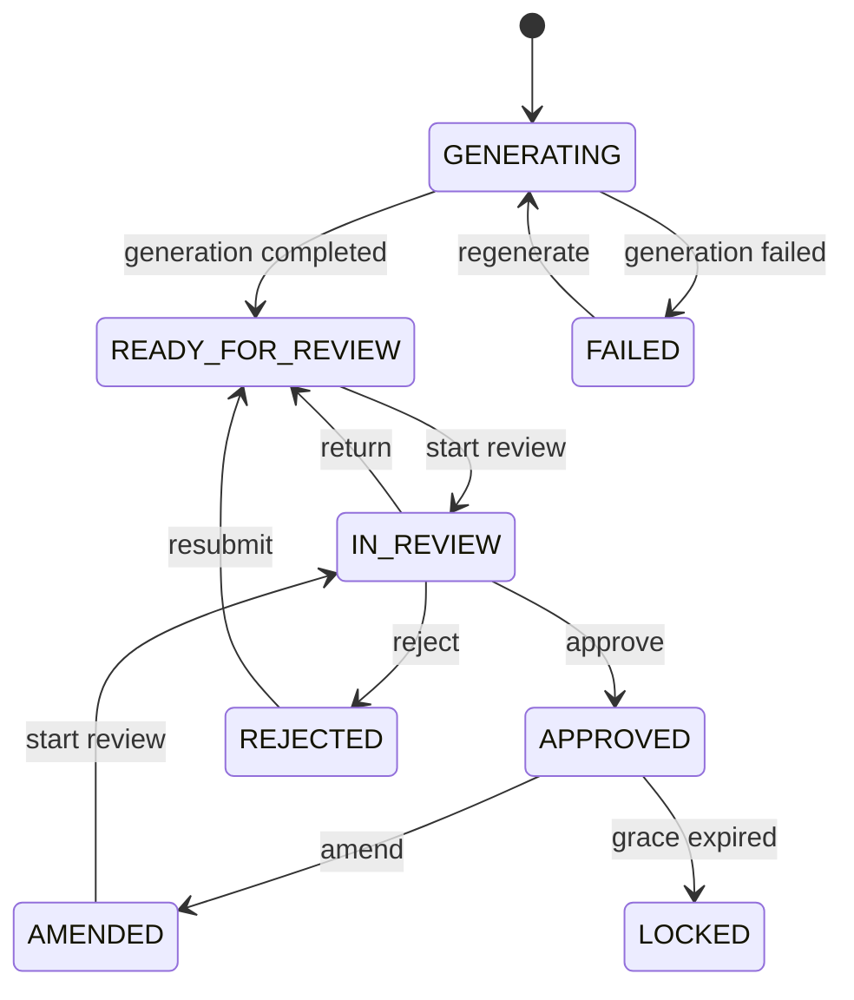
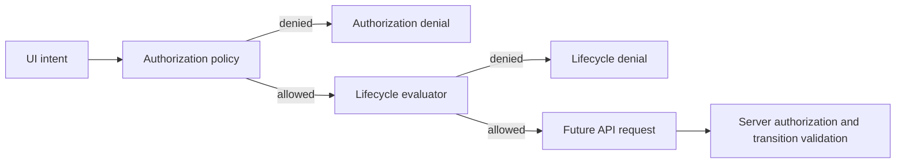
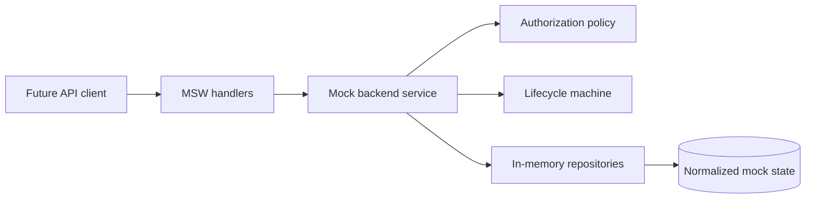

# Architecture

## Domain and Transport Boundaries

DTOs and domain models are deliberately separate. Zod schemas validate untrusted API
payloads at the transport edge; mappers then produce normalized domain objects used by
application logic. This keeps wire-format churn (S/O/A/P keys, nested `authoredBy`,
cursor envelopes) from leaking into features and stores.

`Note` is workflow metadata for one patient session. It does **not** own editable clinical
content. Editable SOAP text lives only on `NoteVersion`, so list/detail shells and review
state can change without copying clinical blobs into every projection.

`NoteVersion` is an immutable snapshot. Every save creates a new version; `parentVersionId`
forms a DAG when amendments branch from an approved ancestor. Mutating past versions is
not part of the model.

Identifiers are branded strings (`NoteId`, `VersionId`, …) constructed only through Zod
parsers / `parse*` helpers. Branding prevents accidentally mixing a patient id with a note
id at compile time without runtime wrapper objects.

Timestamps remain validated ISO-8601 UTC strings (`IsoDateTime`). The domain does not convert
them to JavaScript `Date` values, which avoids timezone and serialization ambiguity until a
later presentation layer needs formatting.

Unknown SOAP section keys are **rejected** via `z.strictObject` (not stripped). Empty
section strings are allowed.

## Note Lifecycle State Machine

The lifecycle evaluator in `src/domain/note-lifecycle` is a **pure** function of status,
action, transition source, and injected context. It has no React, browser, network, storage,
or clock (`Date.now`) dependencies. Callers inject `occurredAt` and `approvedAt`.

Transitions are centralized in `NOTE_TRANSITION_SPECIFICATIONS`. User and server/system
events share the same table and the same `evaluateNoteTransition` function. There is no
second transition graph for reconciliation.

Decisions are a discriminated union. Denied results include a stable `reasonCode` and a
human-readable `reason` so UI can render explanations without re-encoding policy. Allowed
results include `fromStatus`, `toStatus`, and declarative `effects` (assign/release
reviewer, require new version, record rejection reason). The machine never mutates a
`Note`, never creates `ReviewEvent` rows, and never calls APIs.

**Amendment boundary:** amendment is allowed when
`occurredAt - approvedAt <= 24 hours` (inclusive). One millisecond past 24 hours is denied
with `AMENDMENT_GRACE_EXPIRED`. Missing `approvedAt` yields `APPROVAL_TIMESTAMP_REQUIRED`.
If `occurredAt` is before `approvedAt`, the result is `INVALID_TIME_RANGE`.

`getAvailableActions` maps every lifecycle action through the same evaluator so components
do not need status-specific conditionals.

Later steps will apply effects optimistically, persist review events, and reconcile with
server-driven status changes.

## Authorization Policy

Authorization (`src/domain/authorization`) answers whether a **role** may attempt an
operation on a **resource**. Lifecycle answers whether that attempt is valid in the
**current workflow state**. The two concerns stay separate:

- Authorization: role grants, note ownership, assigned-reviewer edit rights, resource presence
- Lifecycle: status edges, MFA, amendment grace window, rejection reason, assigned-reviewer
  transition ownership for approve/reject/return

A single declarative `PERMISSION_DEFINITIONS` table is the source of truth for grants and
ownership rules. `getPermissionsForRole` returns role-level capabilities only; resource
checks still go through `authorize`.

Client authorization is **UX guidance** (disable controls, explain denials). The server must
still enforce authorization and lifecycle validation. Missing permission is not the same as
missing data: `RESOURCE_CONTEXT_REQUIRED` means the caller omitted note context;
`ROLE_NOT_PERMITTED` / `READ_ONLY_ROLE` mean the role cannot attempt the operation.

`combineAuthorizationAndLifecycle` short-circuits on authorization denial, otherwise
preserves the lifecycle denial reason codes unchanged.

## Dummy Backend

The Step 4 dummy backend is a **deterministic local simulation**, not a real API. Core
application services live under `src/mock` and are transport-independent: MSW (or any
HTTP adapter) parses requests, calls a typed service, and maps `MockApiError` values to
HTTP responses. Business rules are not embedded in handlers.

**Repositories** keep normalized Maps privately (`users`, `patients`, `notes`,
`note versions`, `review events`, `completed mutations`). Callers receive frozen clones.
`NoteVersion` and `ReviewEvent` rows are append-only; update helpers reject mutations.

**Deterministic seed** uses Mulberry32 (no `Math.random`). The same `SeedConfig` always
yields the same IDs, statuses, timestamps, patient names, assignments, and version graphs.
Defaults are small; `noteCount` may be set to 5,000 or up to 100,000 for scale exercises.
Integrity validation runs after seed in development/test mode.

**Cursor pagination** encodes opaque base64url JSON (`sort`, `dir`, primary value, note id,
query fingerprint). Cursors are validated at decode time and rejected when they do not
match the current sort/filter fingerprint. Offsets and page numbers are not exposed.

**Listing** supports status multi-select, assigned reviewer, patient id, inclusive
`updatedAt` date bounds (`dateFrom`/`dateTo`), case-insensitive substring search over
patient display name and current SOAP text, and stable sorting (`updatedAt`, `createdAt`,
`patientDisplayName`, `status`) with note id as the secondary key.

**Latency and failure** controllers are centralized (`LatencyController`,
`FailureController`) with injectable PRNG sources. Tests disable both (0 ms / 0%).
Aborted waits reject as typed `ABORTED`.

**Server authorization** requires an explicit `ActorContext` (`x-user-id` /
`x-user-role` at the MSW edge). List requires `NOTES_VIEW`; detail requires
`NOTE_CONTENT_VIEW` with note resource context; `POST /api/dev/seed` requires
`ADMIN_SIMULATION_CONTROL`.

**Lifecycle reuse:** `transitionNote` calls the existing `evaluateNoteTransition` machine,
applies declarative effects, appends one `ReviewEvent` on success, and uses
copy-validate-commit semantics so failed transitions leave state unchanged.

**Deferred to later steps:** React notes list UI, TanStack Query hooks, Zustand stores,
editor/autosave, IndexedDB, offline replay, WebSocket/SSE, presence, telemetry, and
three-way merge UI.
