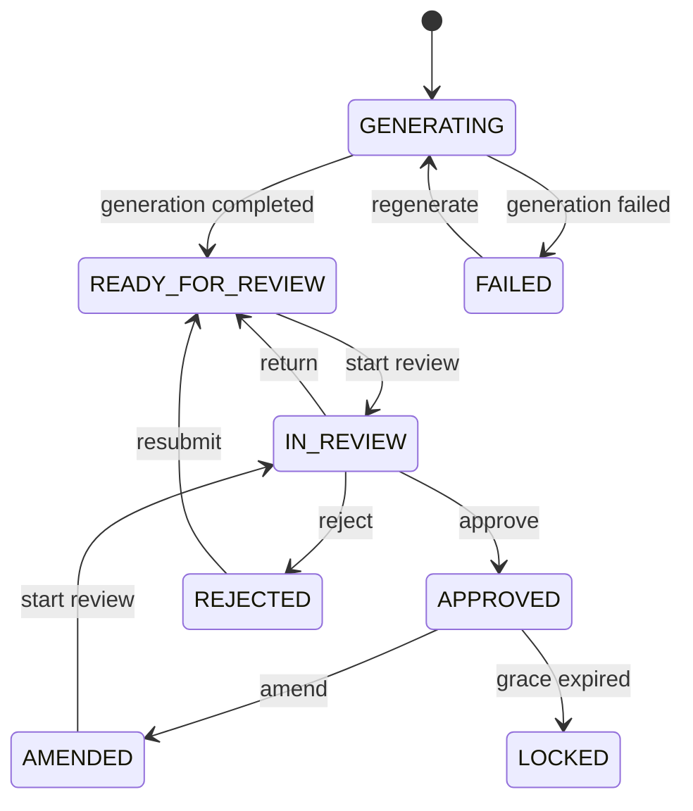
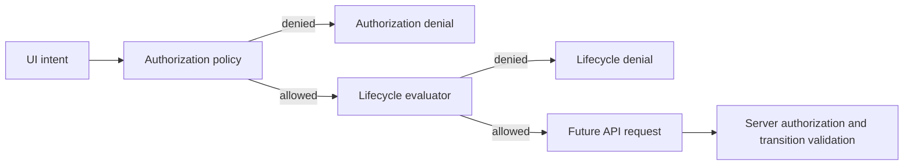
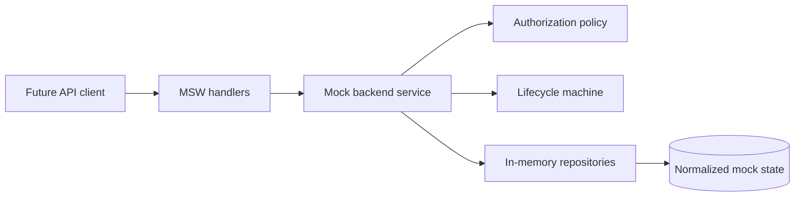
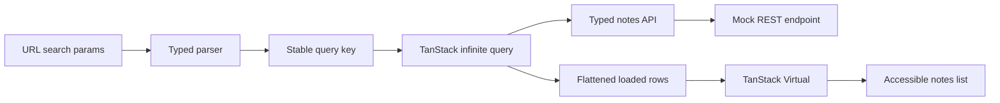
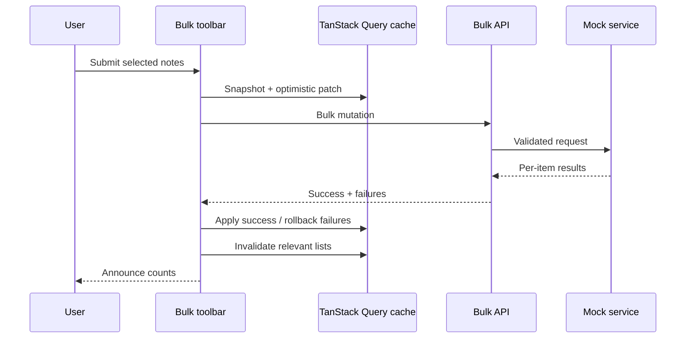
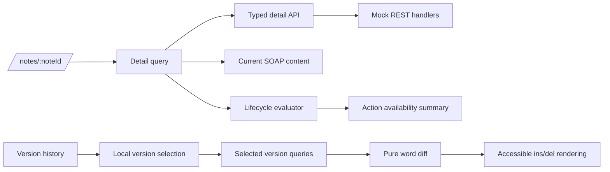
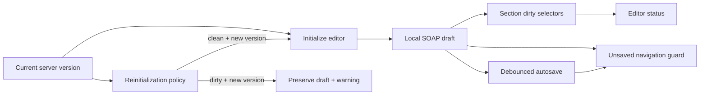
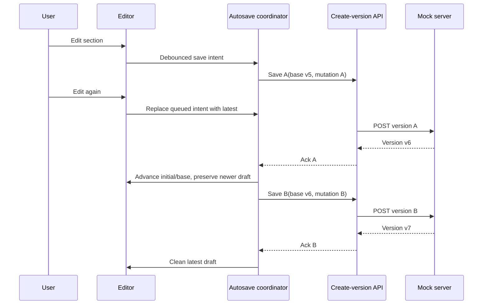
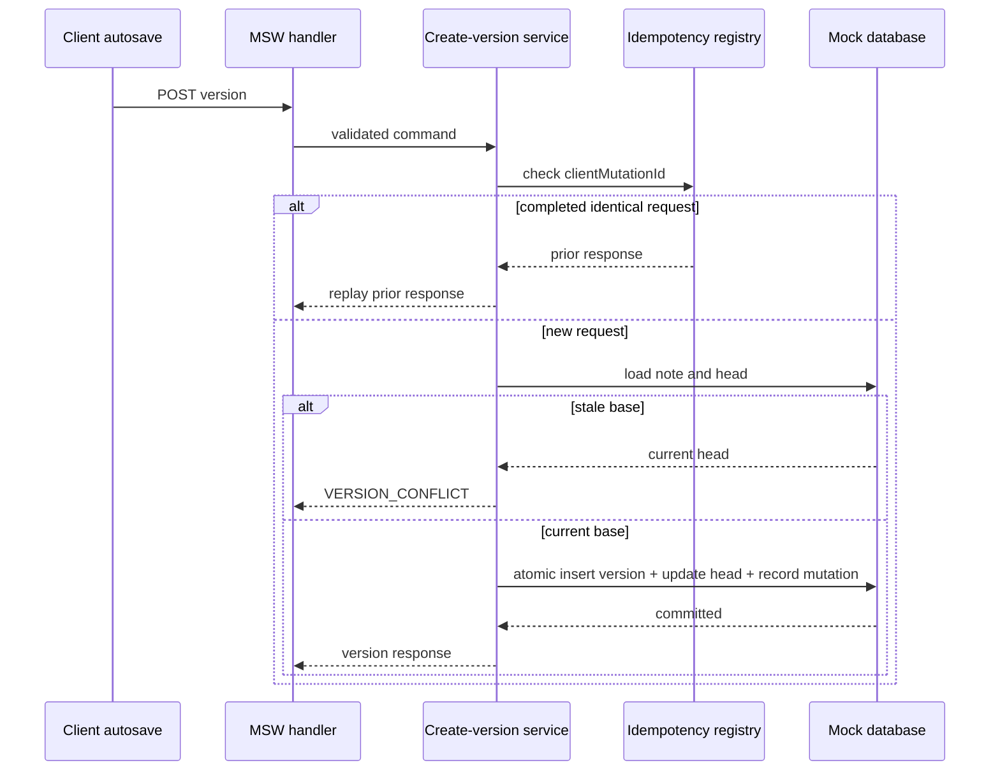

# Architecture

## Domain and Transport Boundaries

DTOs and domain models are deliberately separate. Zod schemas validate untrusted API
payloads at the transport edge; mappers then produce normalized domain objects used by
application logic. This keeps wire-format churn (S/O/A/P keys, nested `authoredBy`,
cursor envelopes) from leaking into features and stores.

`Note` is workflow metadata for one patient session. It does **not** own editable clinical
content. Editable SOAP text lives only on `NoteVersion`, so list/detail shells and review
state can change without copying clinical blobs into every projection.

`NoteVersion` is an immutable snapshot. Every save creates a new version; `parentVersionId`
forms a DAG when amendments branch from an approved ancestor. Mutating past versions is
not part of the model.

Identifiers are branded strings (`NoteId`, `VersionId`, …) constructed only through Zod
parsers / `parse*` helpers. Branding prevents accidentally mixing a patient id with a note
id at compile time without runtime wrapper objects.

Timestamps remain validated ISO-8601 UTC strings (`IsoDateTime`). The domain does not convert
them to JavaScript `Date` values, which avoids timezone and serialization ambiguity until a
later presentation layer needs formatting.

Unknown SOAP section keys are **rejected** via `z.strictObject` (not stripped). Empty
section strings are allowed.

## Note Lifecycle State Machine

The lifecycle evaluator in `src/domain/note-lifecycle` is a **pure** function of status,
action, transition source, and injected context. It has no React, browser, network, storage,
or clock (`Date.now`) dependencies. Callers inject `occurredAt` and `approvedAt`.

Transitions are centralized in `NOTE_TRANSITION_SPECIFICATIONS`. User and server/system
events share the same table and the same `evaluateNoteTransition` function. There is no
second transition graph for reconciliation.

Decisions are a discriminated union. Denied results include a stable `reasonCode` and a
human-readable `reason` so UI can render explanations without re-encoding policy. Allowed
results include `fromStatus`, `toStatus`, and declarative `effects` (assign/release
reviewer, require new version, record rejection reason). The machine never mutates a
`Note`, never creates `ReviewEvent` rows, and never calls APIs.

**Amendment boundary:** amendment is allowed when
`occurredAt - approvedAt <= 24 hours` (inclusive). One millisecond past 24 hours is denied
with `AMENDMENT_GRACE_EXPIRED`. Missing `approvedAt` yields `APPROVAL_TIMESTAMP_REQUIRED`.
If `occurredAt` is before `approvedAt`, the result is `INVALID_TIME_RANGE`.

`getAvailableActions` maps every lifecycle action through the same evaluator so components
do not need status-specific conditionals.

Later steps will apply effects optimistically, persist review events, and reconcile with
server-driven status changes.

## Authorization Policy

Authorization (`src/domain/authorization`) answers whether a **role** may attempt an
operation on a **resource**. Lifecycle answers whether that attempt is valid in the
**current workflow state**. The two concerns stay separate:

- Authorization: role grants, note ownership, assigned-reviewer edit rights, resource presence
- Lifecycle: status edges, MFA, amendment grace window, rejection reason, assigned-reviewer
  transition ownership for approve/reject/return

A single declarative `PERMISSION_DEFINITIONS` table is the source of truth for grants and
ownership rules. `getPermissionsForRole` returns role-level capabilities only; resource
checks still go through `authorize`.

Client authorization is **UX guidance** (disable controls, explain denials). The server must
still enforce authorization and lifecycle validation. Missing permission is not the same as
missing data: `RESOURCE_CONTEXT_REQUIRED` means the caller omitted note context;
`ROLE_NOT_PERMITTED` / `READ_ONLY_ROLE` mean the role cannot attempt the operation.

`combineAuthorizationAndLifecycle` short-circuits on authorization denial, otherwise
preserves the lifecycle denial reason codes unchanged.

## Dummy Backend

The Step 4 dummy backend is a **deterministic local simulation**, not a real API. Core
application services live under `src/mock` and are transport-independent: MSW (or any
HTTP adapter) parses requests, calls a typed service, and maps `MockApiError` values to
HTTP responses. Business rules are not embedded in handlers.

**Repositories** keep normalized Maps privately (`users`, `patients`, `notes`,
`note versions`, `review events`, `completed mutations`). Callers receive frozen clones.
`NoteVersion` and `ReviewEvent` rows are append-only; update helpers reject mutations.

**Deterministic seed** uses Mulberry32 (no `Math.random`). The same `SeedConfig` always
yields the same IDs, statuses, timestamps, patient names, assignments, and version graphs.
Defaults are small; `noteCount` may be set to 5,000 or up to 100,000 for scale exercises.
Integrity validation runs after seed in development/test mode.

**Cursor pagination** encodes opaque base64url JSON (`sort`, `dir`, primary value, note id,
query fingerprint). Cursors are validated at decode time and rejected when they do not
match the current sort/filter fingerprint. Offsets and page numbers are not exposed.

**Listing** supports status multi-select, assigned reviewer, patient id, inclusive
`updatedAt` date bounds (`dateFrom`/`dateTo`), case-insensitive substring search over
patient display name and current SOAP text, and stable sorting (`updatedAt`, `createdAt`,
`patientDisplayName`, `status`) with note id as the secondary key.

**Latency and failure** controllers are centralized (`LatencyController`,
`FailureController`) with injectable PRNG sources. Tests disable both (0 ms / 0%).
Aborted waits reject as typed `ABORTED`.

**Server authorization** requires an explicit `ActorContext` (`x-user-id` /
`x-user-role` at the MSW edge). List requires `NOTES_VIEW`; detail requires
`NOTE_CONTENT_VIEW` with note resource context; `POST /api/dev/seed` requires
`ADMIN_SIMULATION_CONTROL`.

**Lifecycle reuse:** `transitionNote` calls the existing `evaluateNoteTransition` machine,
applies declarative effects, appends one `ReviewEvent` on success, and uses
copy-validate-commit semantics so failed transitions leave state unchanged.

**Deferred to later steps:** TanStack Query hooks beyond list, Zustand stores for
selection/bulk actions, editor/autosave, IndexedDB, offline replay, WebSocket/SSE,
presence, telemetry, and three-way merge UI.

## Notes List Read Path

The `/notes` route is a **read-only** list surface. Filter/search/sort state lives in the
URL. TanStack Query owns server pages. Local React state is limited to ephemeral UI
(draft search/date input text). There is no Zustand store for list filters.

**URL as source of truth:** `status`, `reviewer`, `patient`, `from`, `to`, `q`, `sort`,
and `direction` are parsed by a strict helper. Invalid values fall back to defaults;
unknown keys are ignored. After parse, the address bar is **replace**-navigated to the
canonical serialization (defaults omitted; statuses ordered by `NOTE_STATUSES`). Browser
back/forward and copied URLs therefore restore list state.

**TanStack Query:** `useInfiniteQuery` loads cursor pages (`initialPageParam = null`,
limit 50). The query key includes filters/sort/search but **not** the cursor. Changing
filters automatically resets pagination. AbortSignal cancels in-flight fetches so stale
responses do not win.

**Virtualization:** TanStack Virtual renders only visible rows (+ overscan) inside one
scroll container with table roles for assistive tech. A **Load more** button remains as an
accessible fallback beside automatic near-end fetching.

**Debounced search:** The search input updates immediately; the URL/`q` query updates after
~400 ms. Clearing search applies immediately. Debounce timers cancel on unmount.

**Empty vs no-results:** With no filters and zero notes → “No notes are available.” With
active filters/search and zero matches → “No notes match…” plus Clear filters. Errors show
a typed message and Retry — never a misleading empty state.

**Server-side sorting:** The UI does not re-sort flattened pages. The mock backend applies
the requested sort plus note id as a stable secondary key.

**Memory bound:** Only loaded cursor pages stay in memory/DOM — not the full 100k corpus.

**Deferred after Step 6B:** note detail, SOAP editor, autosave, conflict UI,
IndexedDB/offline, realtime, presence, telemetry, and authentication UI.

## Notes List Mutations

Selection is **page-local React reducer state** (`selectedIds: ReadonlySet<NoteId>`).
It is not stored in the URL, TanStack Query cache, mock backend, or Zustand.

**Visible selection:** “Select all” applies only to currently loaded filtered rows,
not the full backend corpus. Newly loaded cursor pages are not auto-selected.
The header checkbox uses native `indeterminate` when the visible set is partially
selected.

**Filter-change pruning:** After a replacement list query successfully loads its
first page (and is not mid-fetch), selection is pruned to IDs present in the
currently loaded rows. Sorting alone preserves selection when the same IDs remain.
Selection is not cleared during the loading gap to avoid flicker.

**Partial-success batch model:** Each note mutation is atomic. The overall batch
supports partial success — one note failure does not roll back other successful
notes. Idempotency stores the final entire batch response after all item operations
complete. The in-memory mock does **not** implement global multi-note rollback if
completed-response storage fails; under normal operation that write succeeds.

**Assignment policy (status unchanged):**

| Status           | Who may assign   |
| ---------------- | ---------------- |
| READY_FOR_REVIEW | ADMIN            |
| IN_REVIEW        | ADMIN (reassign) |
| AMENDED          | ADMIN            |
| Other            | denied           |

Request-wide permission: `NOTE_BULK_ASSIGN_REVIEWER` (ADMIN). Per-note also checks
`NOTE_ASSIGN_REVIEWER`. Assigning a reviewer does **not** transition
`READY_FOR_REVIEW` → `IN_REVIEW`. No `ReviewEvent` is appended for assignment
because status does not change; a richer audit-action model would be added in
production.

**Regeneration:** Request-wide `NOTE_BULK_REGENERATE` (ADMIN). Each item calls the
existing `transitionNote` service with `REGENERATE` / `USER`. Successful
`FAILED → GENERATING` appends one `ReviewEvent`. Non-FAILED notes fail per-item.

**Idempotency:** `clientMutationId` with operation-specific fingerprints
(`BULK_ASSIGN_REVIEWER`, `BULK_REGENERATE`). Note IDs are sorted before
fingerprinting. Identical retries replay the stored batch response. Same key with
a different fingerprint is rejected (`IDEMPOTENCY_KEY_REUSED`). Keys do not collide
with `CREATE_NOTE_VERSION`.

**Optimistic cache strategy:** Snapshot selected notes from the active infinite
query. Assign patches `assignedReviewer` immediately and preserves existing
`updatedAt` until the server response. Regenerate patches only selected rows whose
loaded status is `FAILED` to `GENERATING`. Request-wide failure restores the full
snapshot. Partial success applies returned summaries for successes and restores
failures from the snapshot. Successful IDs are removed from selection; failed IDs
remain selected. Active list queries are invalidated after settlement without
clearing rendered pages first.

## Note Detail Read Path

The `/notes/:noteId` route is a detail surface. Step 7A delivered the read path;
Step 7B adds an optional local SOAP editor draft (no server save yet).

**Detail query ownership:** TanStack Query owns `notesKeys.detail(noteId)` with
`staleTime` 30s. The query is disabled for invalid route IDs. AbortSignal is forwarded.
`placeholderData` is unset so a previous note cannot flash when the route note changes.
App QueryClient retries are disabled; the detail hook also refuses retries for 403/404.

**Version content on demand:** History refs arrive with the detail payload (no SOAP bodies).
Selected historical versions use `notesKeys.version(noteId, versionId)`. The current version
reuses `detail.currentVersion` without a second fetch. Two historical selections load in
parallel.

**Local comparison selection:** Base/Compare `VersionId`s live in a page-local reducer (not
URL). Defaults: Compare = current, Base = parent (or current when root-only). Same-version
selection is allowed but diff is disabled (read-only content stays visible). History is
sorted **newest revision first**.

**Pure word-diff adapter:** `diffWords` in `src/shared/diff` is a package-free LCS over
whitespace-preserving tokens. UI renders `<ins>` / `<del>` with an accessible legend and
does not use `dangerouslySetInnerHTML`.

**Lifecycle-derived action presentation:** User actions are evaluated via
`evaluateNoteTransition` + `authorize` + `combineAuthorizationAndLifecycle`. Results are
shown as a read-only availability summary — no clickable mutation controls in 7A.
`approvedAt` is derived from the latest ReviewEvent with `toStatus === APPROVED`.
`occurredAt` is injected through `getUiOccurredAt` (not inside pure evaluation).

**Error-state distinctions:** Invalid route (parser failure), 403 Forbidden, 404 Not found,
and generic/network (with Retry). Diff fetch failures keep the current note view and show a
local alert.

**Deferred from 7A:** presence/SSE, autosave, transition/save mutations,
conflict UI, offline/IndexedDB, telemetry, and authentication UI. SOAP editing
draft state is Step 7B (below).

## SOAP Editor State

Step 7B added the SOAP editor on Note Detail. TanStack Query owns the server
`currentVersion`. The editor reducer owns an immutable local draft. Step 8 autosave updates
the detail cache only through pure reconciliation helpers after a successful create-version.

**Immutable reducer:** `INITIALIZE`, `UPDATE_SECTION`, `RESET_SECTION`, `RESET_ALL`,
`ACCEPT_SAVED_VERSION` (full replace), and `ACKNOWLEDGE_SAVED_VERSION` (advance base /
initial while preserving any newer local draft). Nested SOAP objects are cloned and frozen.

**Section-level dirty tracking:** Each of `subjective` / `objective` / `assessment` / `plan`
is tracked independently in a `ReadonlySet`. Dirty comparison uses **exact string equality**
(no trim) because whitespace may be clinically meaningful.

**baseVersionId:** The editor records the server version id it was initialized from. Only the
current head initializes the editor; historical version bodies never do. Successful autosave
acknowledgments advance `baseVersionId` via `ACKNOWLEDGE_SAVED_VERSION`.

**Access-policy composition:** `authorize(NOTE_EDIT)` then `evaluateVersionSavePolicy`.
Editable statuses remain `IN_REVIEW` (assigned reviewer or ADMIN), `REJECTED` / `AMENDED`
(owning clinician or ADMIN). Other statuses stay read-only.

**Explicit edit mode:** Detail opens read-only. When access allows, **Edit note** initializes
a clean draft from the current version. Cancel on a clean editor exits immediately; discard
on a dirty editor confirms, restores initial content, and exits edit mode. Version comparison
remains separate and is hidden while editing.

**Unsaved navigation protection:** React Router `useBlocker` (data router) blocks in-app
navigation while dirty **or** while autosave has unacked work (debouncing / saving / queued /
retryable error / conflict); `beforeunload` follows the same guard. Confirmations never
include clinical text.

**Incoming server version:** Pure `evaluateEditorReinitialization` decides
`NO_CHANGE` / `REINITIALIZE` / `PRESERVE_DIRTY_AND_WARN`. Dirty drafts are never overwritten;
a non-destructive newer-version warning is shown instead. Three-way merge UI is Step 9.

## Autosave and Serialized Version Creation

Step 8 wires the SOAP editor to `POST /api/notes/:id/versions` through a **note-scoped
AutosaveCoordinator** (framework-independent). React owns debounce and UI; the coordinator
owns request serialization.

**700ms debounce:** Local typing updates the reducer immediately. Server saves start only after
`AUTOSAVE_DEBOUNCE_MS` (700) of quiet. Rapid edits reset the timer. Clean drafts, closed edit
mode, revoked access, and `CONFLICT` cancel pending debounce and do not schedule saves.
Retryable `ERROR` pauses automatic enqueue until explicit Retry (no rapid infinite loop).

**One in-flight save:** At most one create-version request per open edit session. Edits during
an in-flight save replace a single coalesced follow-up intent (latest content only).

**Follow-up coalescing:** When the in-flight save succeeds, if queued content still differs
from the saved content, exactly one follow-up starts with:

- `baseVersionId` = returned version id
- a **new** `clientMutationId`
- the latest queued SOAP content

If queued content equals the just-saved content, no follow-up is sent.

**clientMutationId:** Generated only through `ClientMutationIdGenerator` (`crypto.randomUUID`
in the browser; deterministic sequence in tests). Every genuinely new save gets a new id.
Retries of the exact failed intent reuse the same id. Follow-ups and future conflict-resolution
saves (Step 9) require a new id. No `Math.random`.

**Acknowledgment:** Success dispatches `ACKNOWLEDGE_SAVED_VERSION`, which advances
`initialContent` / `baseVersionId` and recalculates dirty sections against the saved content
**without** replacing a newer local draft. Stale acknowledgments that neither match the
expected prior base nor the already-acked version are ignored. `ACCEPT_SAVED_VERSION` remains
available for full replacement when needed.

**Status state machine (discriminated):** `CLEAN` | `DEBOUNCING` | `SAVING` | `QUEUED` |
`SAVED` | `ERROR` (retryable flag) | `CONFLICT`. UI labels are unambiguous; `aria-live="polite"`
does not claim Saved before server acknowledgment.

**Retry:** Manual Retry for network / 5xx only. Reuses the failed intent (same mutation id,
base, content). Newer queued drafts follow after a successful retry. 403 / validation are
non-retryable. Aborts from dispose are not shown as save failures.

**Conflict (Step 8):** HTTP 409 `version_conflict` enters `CONFLICT`, preserves the local
draft and dirty set, drops queued automatic follow-ups, and stops autosave. No merge UI yet —
only “Conflict resolution required” plus a preservation message.

**Query-cache reconciliation:** On success, pure helpers update the note-detail cache
(current version, content from the saved command, revision / parent from the response, actor
for authorship). Success DTO has no timestamp, so prior `updatedAt` / `createdAt` are retained
and detail is soft-invalidated for a later authoritative refresh — timestamps are not
fabricated. Version history appends the new ref once (idempotent on replay). List queries are
invalidated without wiping visible rows.

**Navigation / disposal:** In-flight or queued work keeps the navigation guard active. Session
dispose clears the debounce timer, aborts in-flight fetch when appropriate, and drops
listeners. Intentional discard abort does not surface as a user-facing save error.

**Deferred to Step 9:** three-way conflict resolution UI, merge controls, conflict diff
rendering, IndexedDB / offline queue / replay, SSE/WebSocket, presence, telemetry.

## Version Creation and Concurrency

Content saves create **immutable** `NoteVersion` rows. The mock never mutates an existing
version in place. `POST /api/notes/:id/versions` accepts `baseVersionId`, SOAP content, and
`clientMutationId`.

**baseVersionId check:** the base must exist, belong to the note, and equal
`note.currentVersionId`. A same-note stale base returns **409** `version_conflict` with the
current head summary and nearest common ancestor. Silent rebase is not allowed.

**Idempotency:** `clientMutationId` is bound to the first observed request fingerprint
(operation, noteId, baseVersionId, actor user id, canonical SOAP text). Role and
`occurredAt` are excluded from the fingerprint. Successful completions are replayed without
creating another version. A different fingerprint for the same key returns
`IDEMPOTENCY_KEY_REUSED` (409). Failed attempts (including conflicts) bind the key but do
not store a successful completion, so the same fingerprint may re-evaluate; a resolved merge
must use a **new** `clientMutationId`.

**Atomic commit:** version insert, note head/`updatedAt` update, and completed-mutation
record share one preflight-then-apply database commit (`commitCreateVersion`).

**Revision allocation:** `max(revisions for note) + 1`. Version IDs use a database-scoped
counter (`ver_generated_000001`, …) reset with the database.

**Common ancestor:** walk parent links from A to root, then walk B until an A ancestor is
found (single-parent lineages). Cycles / missing parents / cross-note versions are
`VERSION_GRAPH_INVALID`.

**Content-save policy** (distinct from lifecycle transitions): editable statuses are
`IN_REVIEW` (assigned reviewer or ADMIN), `REJECTED` and `AMENDED` (owning clinician or
ADMIN). `READY_FOR_REVIEW`, `GENERATING`, `FAILED`, `APPROVED`, and `LOCKED` deny saves.
Authorization still requires `NOTE_EDIT` first.

Client autosave coordination is implemented in Step 8 (above). Three-way merge UI remains
Step 9.

