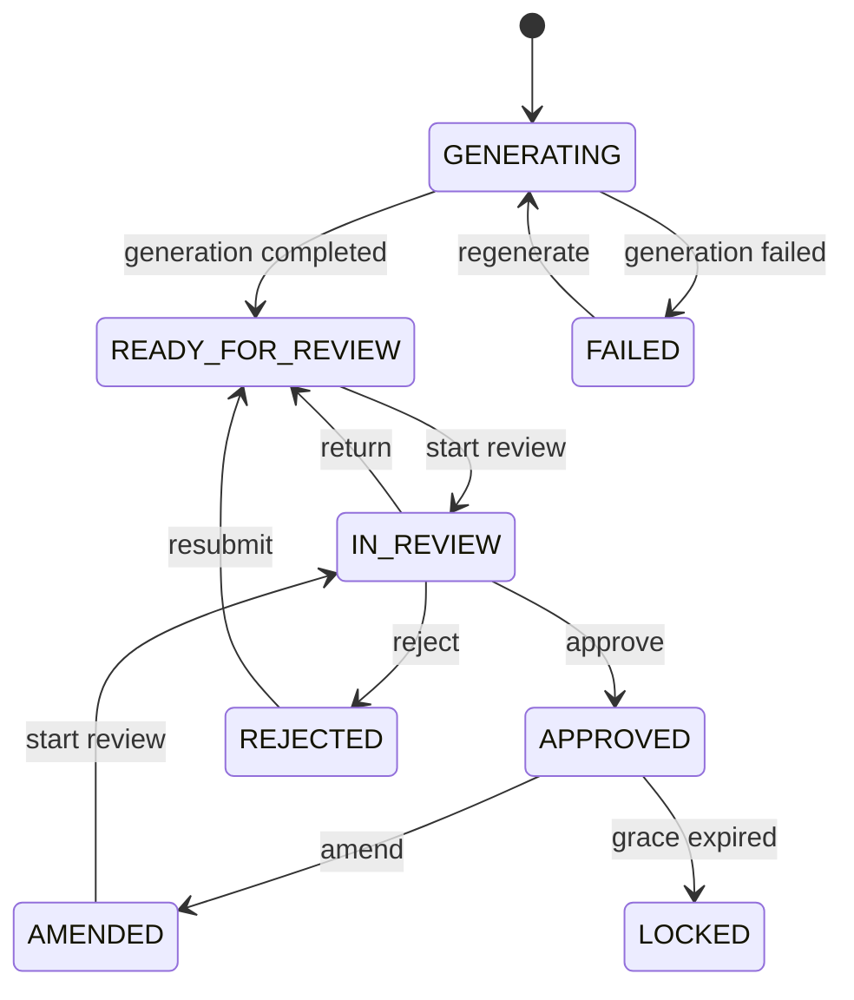

# Architecture

## Domain and Transport Boundaries

DTOs and domain models are deliberately separate. Zod schemas validate untrusted API
payloads at the transport edge; mappers then produce normalized domain objects used by
application logic. This keeps wire-format churn (S/O/A/P keys, nested `authoredBy`,
cursor envelopes) from leaking into features and stores.

`Note` is workflow metadata for one patient session. It does **not** own editable clinical
content. Editable SOAP text lives only on `NoteVersion`, so list/detail shells and review
state can change without copying clinical blobs into every projection.

`NoteVersion` is an immutable snapshot. Every save creates a new version; `parentVersionId`
forms a DAG when amendments branch from an approved ancestor. Mutating past versions is
not part of the model.

Identifiers are branded strings (`NoteId`, `VersionId`, …) constructed only through Zod
parsers / `parse*` helpers. Branding prevents accidentally mixing a patient id with a note
id at compile time without runtime wrapper objects.

Timestamps remain validated ISO-8601 UTC strings (`IsoDateTime`). The domain does not convert
them to JavaScript `Date` values, which avoids timezone and serialization ambiguity until a
later presentation layer needs formatting.

Unknown SOAP section keys are **rejected** via `z.strictObject` (not stripped). Empty
section strings are allowed.

## Note Lifecycle State Machine

The lifecycle evaluator in `src/domain/note-lifecycle` is a **pure** function of status,
action, transition source, and injected context. It has no React, browser, network, storage,
or clock (`Date.now`) dependencies. Callers inject `occurredAt` and `approvedAt`.

Transitions are centralized in `NOTE_TRANSITION_SPECIFICATIONS`. User and server/system
events share the same table and the same `evaluateNoteTransition` function. There is no
second transition graph for reconciliation.

Decisions are a discriminated union. Denied results include a stable `reasonCode` and a
human-readable `reason` so UI can render explanations without re-encoding policy. Allowed
results include `fromStatus`, `toStatus`, and declarative `effects` (assign/release
reviewer, require new version, record rejection reason). The machine never mutates a
`Note`, never creates `ReviewEvent` rows, and never calls APIs.

**Amendment boundary:** amendment is allowed when
`occurredAt - approvedAt <= 24 hours` (inclusive). One millisecond past 24 hours is denied
with `AMENDMENT_GRACE_EXPIRED`. Missing `approvedAt` yields `APPROVAL_TIMESTAMP_REQUIRED`.
If `occurredAt` is before `approvedAt`, the result is `INVALID_TIME_RANGE`.

`getAvailableActions` maps every lifecycle action through the same evaluator so components
do not need status-specific conditionals.

Later steps will apply effects optimistically, persist review events, and reconcile with
server-driven status changes.

